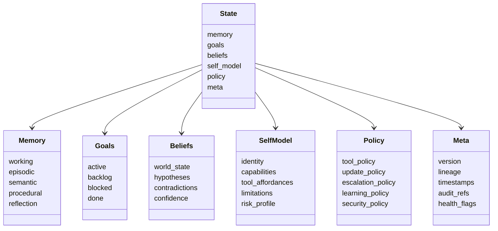

# 结构主导认知执行系统项目立项分析报告

## 执行摘要

结合本轮对话，这个项目最有价值的方向，不是再造一个“由模型临场决定一切”的 Agent，而是把控制权转移到显式状态 `S(t)`、策略层、审计层和人类干预点上，让 LLM 退居为一个受约束、可替换、可校验的认知算子。现有主流框架已经提供了工具调用、状态持久化、事件驱动流程和长期记忆的工程积木，而经典认知架构则提供了“记忆分层 + 运行时状态 + 规则/程序性知识”的结构思想，这两类经验可以直接组装为一个“结构主导”的认知执行系统。citeturn15view1turn11view6turn16view6turn11view3turn11view4turn11view0turn11view1

本项目的 MVP 应定义为：单智能体、有限工具域、强约束、强审计、强人工干预的认知执行内核，而不是“万能代码”、开放式自我扩张代理，或完整的“数字人”模拟。AgentBench 指出，现阶段 LLM Agent 的主要瓶颈仍是长期推理、决策与指令遵循；GAIA 也显示，真实世界工具型任务距离稳定可靠仍有明显差距，因此项目早期必须主动收缩边界。citeturn10view0turn10view1

技术上，最推荐的路线是 **`S(t)` 状态化内核 + RAG 作为语义记忆底座 + 反思/程序性记忆作为增量层**；微调只保留给“格式、风格、低延迟专用子任务”这类窄场景。这样既能吸收 RAG 的可更新和可追溯优势，也能保留状态机的可控、可回放和可解释特性，同时规避持续微调带来的遗忘、成本和审计困难。citeturn10view4turn10view5turn10view3turn16view7turn20view0turn20view1turn18search1turn18search4

如果立项，最合理的建议是走“平衡路线”：先用 3 个月做出最小可运行原型，6 个月建立评估与控制闭环，12 个月再谈自适应程序性知识和更强自我模型，而不是一开始就追求拟人化、自我意识化或全域自治。citeturn11view3turn11view4turn12view6turn21view5turn21view6

## 项目背景与目标

根据本轮对话，你真正要探索的，不是“LLM 能不能像大脑一样直接控制一切”，而是**能否把认知执行拆成受代码、状态和策略约束的结构化系统**。这与当前许多 Agent 实现的关键差异在于：现有工具文档通常仍然把“是否调用工具、以什么参数调用”描述为模型依据上下文做出的决定；而经典认知架构更强调缓冲区、记忆模块、规则和状态转移对行为的组织作用。换句话说，你要做的是 **structure-first，而不是 model-first**。citeturn15view1turn11view1turn11view0

同时，现有真实世界基准并不支持把项目直接定义为“开放式通用代理”。GAIA 需要推理、多模态、网页浏览和工具使用等综合能力；AgentBench 覆盖 8 类交互环境，并明确指出长期推理、决策与指令遵循仍是主要障碍。这意味着，立项方案必须以**有边界的问题域**和**可验证的工程闭环**为核心，而不是以“大而全的智能体愿景”来组织团队与预算。citeturn10view1turn10view0

| 维度 | 立项建议 |
|---|---|
| 项目愿景 | 构建一个以显式状态 `S(t)` 为核心的认知执行系统：输入自然语言任务，输出**受策略约束**的计划、工具调用、状态更新和可追溯结果。 |
| 核心价值 | 提升多轮任务的**连贯性、可控性、可审计性、可复现性**，并让“记忆”从 prompt 技巧变成结构化资产。 |
| MVP 边界 | 单智能体；最多 3–5 类任务模板；10–20 个受控工具；强人工审批；不允许系统自行扩展权限。 |
| 推荐首批场景 | 结构化信息抽取与写回、规则受限分析任务、多步知识查询与可追溯回答、内部流程执行。 |
| 成功判据 | 状态可重放；日志可追责；同类任务成功率优于纯 tool-calling baseline；高风险动作全部进入人工审批。 |
| 关键差异 | “LLM 产生内容”不是系统本体；**状态机 + 记忆层 + 策略层 + 审计层**才是系统本体。 |

| 关键假设 | 含义 | 早期验证方法 |
|---|---|---|
| 显式状态比纯上下文更稳定 | 长期连贯性主要来自状态演化，而不是把更多聊天历史塞回上下文 | 比较 `S(t)` 系统与纯 RAG/纯对话缓存的多轮一致性 |
| 自我感应被工程化为“自我模型” | 不把“自我认知”当作意识问题，而把它定义为身份一致性、能力校准、风险偏好和工具可供性建模 | 做 capability calibration、identity consistency、overclaim rate 测试 |
| 程序性知识必须外显 | 稳定可复用的“会做什么”应沉淀为规则、技能模板和批准后的流程片段 | 从成功轨迹中挖掘模板，人工审核后再启用 |
| RAG 只是记忆底座，不是控制中枢 | 检索可以提供事实，但不能代替 goals、beliefs、policy | 将检索结果视为 belief 候选，而非直接写入行动计划 |
| 微调只适合窄任务 | 微调适合格式化、风格化、延迟优化等窄场景，不适合作为系统级长期记忆主线 | 对比微调前后在格式任务与长期一致性任务上的收益差异 |

| 明确不做的目标 | 原因 |
|---|---|
| 万能代码 | 无边界任务空间无法定义验收，也无法定义安全与责任边界。 |
| 开放式自主目标生成 | 会直接把项目推向不可审计与不可控。 |
| 无约束自我修改/自我复制 | 与安全、合规、审计目标冲突。 |
| 完整数字人 | 表层拟人化可做成 UI，但不应成为认知内核目标；否则会把项目从“执行系统”拉向“仿人系统”。 |
| 以“自我意识”为立项目标 | 这是不可验证、不可验收、也不利于工程排期的目标。 |

**工程化结论：** 这个项目最合适的愿景，不是“做一个像人一样的智能体”，而是“做一个把 LLM 变成可编排、可审计、可校准算子的认知执行引擎”；MVP 必须以边界清晰和可验证为先。citeturn10view0turn10view1turn15view1turn11view0turn11view1

## 文献与案例综述

从公开资料看，现有代表性系统大致可分为四类：一类是**认知架构**，强调记忆分层与运行机制；一类是**工具/流程框架**，强调 tool calling、workflow、state persistence；一类是**记忆/反思型 Agent**，强调长程轨迹与经验更新；还有一类是**声明式与编译式框架**，强调把 prompt loop 提升为可优化程序。你的项目不应该复制其中任何一类，而应吸收它们的优点，重新围绕 `S(t)` 组织。citeturn11view0turn11view1turn10view4turn10view6turn15view2turn11view4turn11view2

| 系统/框架 | 核心思想 | 适用场景 | 优点 | 缺点 | 对本项目的借鉴点 | 代表来源 |
|---|---|---|---|---|---|---|
| Soar | 用产生式规则、子目标和多类长期记忆构造通用智能系统 | 研究型认知代理、规则驱动问题求解 | 记忆分层清晰；程序性知识显式；学习机制明确 | 现代 LLM / 工具生态接入较弱；工程门槛高 | 借鉴**程序性/语义/情景记忆分离**与“状态转移先于生成” | citeturn11view0turn16view1turn16view2 |
| ACT-R | 模块、缓冲区、模式匹配器构成认知运行时；缓冲区内容代表当前状态 | 认知建模、人类行为模拟 | “当前状态”定义非常清楚；运行时结构明确 | 工程应用到现代企业 Agent 需重建外围设施 | 借鉴**buffer = runtime state**，把 `S(t)` 视作一等对象 | citeturn11view1turn16view3 |
| RAG | 结合参数记忆与显式非参数记忆（向量索引/文档） | 知识密集问答、可追溯生成 | 知识可更新；可给出处；减轻 parametric hallucination | 检索到的是材料，不是完整执行状态 | 借鉴**语义记忆外置**与 provenance 机制 | citeturn10view4 |
| ReAct | 让推理轨迹与行动/工具调用交错生成 | 工具型问答、互动环境 | 行动前后逻辑链清楚；可解释性更强 | 仍是模型中心循环；状态结构常不稳定 | 借鉴**思考-行动-观察**的事件流，但外置为状态机 | citeturn10view6 |
| LangChain / LangGraph | 工具、状态、中间件、持久化 checkpoint、HITL 组成长程工作流 | 生产级 Agent、状态化编排 | 持久化、回放、人工介入、长短期记忆支持较成熟 | 容易演化为“框架驱动设计”，核心状态语义由开发者自己补齐 | 借鉴**checkpoint、thread、state persistence、tool middleware** | citeturn15view0turn15view1turn15view2turn11view3turn16view7 |
| OpenAI Function Calling / Responses | 通过 JSON Schema tool calling、structured outputs 和 stateful conversations 组织模型输出 | 需要严格结构输出和受控工具调用的应用 | 接口规范清楚；适合把 LLM 嵌入结构化系统 | 只解决“接口层”，不解决系统级认知状态设计 | 直接用于**消息协议、schema 约束、conversation item 持久化** | citeturn16view4turn16view5turn11view6turn16view6 |
| Semantic Kernel | 用事件驱动 Process/Step/Function 组织企业流程，并强调审计能力 | 企业流程自动化 | 流程概念明确；可复用；可审计 | 对“认知内核”定义较少，偏流程应用层 | 借鉴**事件驱动步骤、流程内审计、企业权限边界** | citeturn11view4turn0search1 |
| LlamaIndex Workflows | 事件驱动、step-based workflow；可定制 memory put/get | 检索增强、Agent workflow、文档系统 | 记忆接口清楚；接入生态广 | 更偏应用构建，不天然给出统一状态哲学 | 借鉴**memory API 和 step/event workflow** | citeturn11view5turn11view7turn17view3 |
| DSPy | 用声明式模块 + 编译器，把 LM 调用编成可优化程序 | 需要评测驱动优化的 LM pipeline | 可把 prompt 工程转成程序优化问题；可度量 | 更适合模块编译与优化，不等于完整执行内核 | 借鉴**TaskSpec / PlanSpec 的声明式接口**与 metric-driven compilation | citeturn11view2turn17view0 |
| AutoGPT | 持续运行的 AI agent / workflow platform，支持 block 式流程 | 自动化工作流、低代码 agent | 强调连续代理和工作流拼装 | 容易把执行权过多让给模型；早期生态有不稳定印象 | 借鉴**流程装配体验**，但不采用“弱状态、强模型”思路 | citeturn17view1 |
| MemGPT | 借鉴操作系统分层内存与中断机制，管理不同 memory tiers | 长文档分析、长期会话 | 长期记忆设计思路强；控制流中断有启发性 | 仍需上层策略和权限框架配合 | 借鉴**memory tiering + interrupt** 设计 | citeturn10view5 |
| Generative Agents | 用自然语言经历记录、反思和动态检索驱动 believable behavior | 多轮仿真、社会行为模拟 | observation / planning / reflection 三段式清晰 | 偏仿真，不直接适配生产执行系统 | 借鉴**反思层和经验摘要层**，但不追求“像人”外观 | citeturn10view2 |
| Reflexion | 基于语言反馈的反思型 agent，用 episodic memory buffer 改进下一次尝试 | 重试式任务、编码、序列决策 | 不改权重即可渐进提升；失败后学习机制直观 | 容易积累噪声反思；需要严格筛选与压缩 | 借鉴**反思记忆作为程序性候选而不是直接真理** | citeturn10view3 |

**工程化结论：** 最值得借鉴的不是某个现成框架本身，而是三件事：其一，Soar/ACT-R 的**状态与记忆分层**；其二，LangGraph/Responses/Semantic Kernel 的**持久化、流程和接口约束**；其三，MemGPT/Reflexion/Generative Agents 的**反思与分层记忆**。这三者叠加，才是本项目的真正前身。citeturn11view0turn11view1turn11view3turn11view4turn16view4turn16view5turn10view5turn10view3turn10view2

## 技术架构设计

建议把系统定义为一个 **state-first、event-sourced、policy-guarded** 的认知执行引擎。它的基本更新式不是“模型看完上下文后自由发挥”，而是：

`S(t+1) = reduce(S(t), observation_t, tool_result_t, reflection_t, policy_t)`

其中 LLM 只负责若干类型化算子：任务意图编译、belief 提炼、候选计划生成、反思压缩和最终叙述；而状态更新、权限判断、日志记录、回滚和审批，全部由外围结构完成。这个思路同时吸收了 ACT-R 的“当前状态由缓冲区表示”、Soar 的记忆分层、ReAct 的行动-观察循环，以及现代框架中的 checkpoint / schema / workflow 能力。citeturn11view1turn11view0turn10view6turn11view3turn16view4turn16view5turn11view4

| 字段 | 推荐子结构 | 数据类型 | 存储策略 | 更新规则 | 压缩 / 抽象方法 |
|---|---|---|---|---|---|
| `memory.working` | 当前步骤轨迹、最近观测、最近工具结果 | `deque[TraceItem]` / JSONB | Redis + checkpoint snapshot | 每步 append；超 token 或窗口时触发总结 | 滑动窗口摘要、保留关键 action/observation 边 |
| `memory.episodic` | 会话级/任务级经历 | `Episode[]` | PostgreSQL JSONB + 对象存储 | 每个阶段完成后提交 episode；禁止即时覆盖历史 | 层级摘要：任务→会话→日/周；保留 provenance |
| `memory.semantic` | 事实、概念、实体关系、文档指针 | `FactGraph` + vector refs | PostgreSQL + pgvector + 边表 | 仅由“验证通过”的 belief 提升而来；任何事实都带证据来源 | 去重、实体合并、概念折叠、置信度衰减 |
| `memory.procedural` | 规则、技能模板、可复用流程片段 | `RuleSpec` / YAML / JSON Schema | Git 版本库 + 数据库注册表 | 从重复成功轨迹中挖掘候选规则；默认需人工批准 | 参数化归纳、模板抽象、适用边界显式化 |
| `memory.reflection` | 失败总结、成功模式、异常说明 | `Reflection[]` | PostgreSQL + vector | 任务完成或失败后生成；不直接写成事实 | 失败模式聚类、策略标签化、只提升高价值反思 |
| `goals` | active / backlog / blocked / done | `Goal[]` + finite-state metadata | 关系表 + event log | 由任务编译器创建；通过状态机推进 | 归档已完成目标，仅保留目标树摘要 |
| `beliefs` | 世界状态、假设、矛盾集、置信度 | `BeliefGraph` | JSONB + 证据索引 | 每次观测/工具结果都会触发 belief reconcile | 冲突解析、低置信假设清理、陈旧 belief 衰减 |
| `self_model` | 身份描述、能力轮廓、工具可供性、风险偏好、局限 | `SelfModel` | JSONB + calibration metrics table | 由历史表现和显式配置共同更新；禁止模型直接“自定义权限” | 滚动统计、指数衰减、任务族级能力抽象 |
| `policy` | tool policy、security policy、update policy、escalation policy、learning policy | `PolicyBundle` | 代码 + 版本化配置 | 只允许通过发布/审批更新；线上热变更受限 | 继承 + override；策略 diff 可审计 |
| `meta` | version、lineage、timestamp、trace_id、audit_ref、health flags | `MetaState` | append-only event log + 审计库 | 每次状态转移都更新 | 不做破坏性压缩，只做索引、聚合和摘要视图 |

下表给出 **LLM 的推荐插入点**。核心原则是：LLM 不直接拥有“执行权”，只拥有“提议权”和“解释权”。所有高风险输出都必须经过 schema 校验、policy 检查和必要的人工审批。这样的接口风格与 function calling、structured outputs 以及 MCP 式工具协议天然兼容。citeturn16view4turn16view5turn11view8

| LLM 插入点 | 输入 | 输出 | 约束方式 | 备注 |
|---|---|---|---|---|
| 任务编译器 | 用户目标、上下文、当前 `S(t)` 摘要 | `TaskSpec` | JSON Schema + 术语表 | 把自然语言压成结构任务 |
| belief 提炼器 | observation / tool output | `BeliefCandidate[]` | evidence 必填；confidence 必填 | 候选 belief 不直接生效 |
| 计划生成器 | `TaskSpec + goals + beliefs + self_model + policy` | `PlanSpec` | allowed_tools 白名单；strict schema | 模型只输出候选计划 |
| 反思压缩器 | 任务轨迹、成败标签 | `Reflection` / `RuleCandidate` | 只允许写入 reflection 区 | 避免把失败经验直接提升为规则 |
| 响应叙述器 | 已批准状态、最终结果、证据链 | 面向用户/系统的输出 | 模板 + 风格约束 | 只消费已确认状态 |

下图展示建议的系统组件关系。图中唯一“智能不透明体”是 LLM，但它被放在编排器和安全层的中间，而不是系统最顶层。citeturn11view3turn11view4turn16view6turn16view7turn11view8

```mermaid
flowchart LR
    U[用户或上游系统]
    C[任务编译器]
    O[编排器与状态机]
    S[(S(t) 状态库)]
    L[LLM算子层]
    T[工具总线]
    M[(语义库与记忆层)]
    P[策略与权限引擎]
    H[人工审批台]
    A[(审计日志与检查点)]

    U --> C --> O
    O <--> S
    O --> L
    L -->|TaskSpec / PlanSpec / Reflection| O
    O --> T
    T <--> M
    O --> P
    P -->|允许 / 阻断 / 降级| T
    P <--> H
    O --> A
    S --> A
    T --> A
```

下面是建议的消息格式示例。它体现三件事：一是 `state_ref` 是显式对象；二是可用工具集来自 policy，而不是来自 prompt 中的模糊说明；三是所有状态修改都必须回写为 `state.patch` 事件。

```json
{
  "event": "llm.plan.request",
  "trace_id": "tr_9f2a",
  "state_ref": "state://thread/42@v7",
  "task": {
    "type": "analysis",
    "goal": "生成一份可追溯结论",
    "success_criteria": ["引用来源", "给出不确定性", "不得执行外部写操作"]
  },
  "allowed_tools": [
    "retrieve_semantic_memory",
    "search_docs",
    "request_human_approval"
  ],
  "response_schema": {
    "type": "object",
    "required": ["intent", "plan", "state_patch", "confidence"],
    "properties": {
      "intent": {"type": "string"},
      "plan": {"type": "array"},
      "state_patch": {"type": "object"},
      "confidence": {"type": "number", "minimum": 0, "maximum": 1}
    },
    "additionalProperties": false
  }
}
```

```json
{
  "event": "state.patch",
  "trace_id": "tr_9f2a",
  "base_version": 7,
  "patch": {
    "goals": [{"op": "set_status", "goal_id": "g1", "status": "in_progress"}],
    "beliefs": [{"op": "upsert", "key": "source_count", "value": 4, "confidence": 0.92}],
    "meta": [{"op": "set", "key": "last_actor", "value": "planner"}]
  },
  "provenance": ["tool:search_docs#s3", "llm:plan#r2"]
}
```

状态结构还可以用下面的结构图理解。`self_model` 在这里不是“意识模块”，而是**关于系统自身能力、边界和风险的可校准描述**；这与拟人化叙事必须严格区分。citeturn10view2turn10view3turn10view5



**工程化结论：** `S(t)` 应被设计成系统的“唯一认知真源”，而不是聊天历史的副产品；LLM 的职责是生成结构化候选，而不是直接拥有行动权。只有这样，项目才能在未来扩展为真正的认知执行引擎。citeturn11view1turn11view0turn11view3turn16view4turn16view5

## 记忆管理方案比较

现有“记忆”路线可以粗分三条。第一条是**权重内化**：通过持续微调或持续学习把新的知识、风格和偏好写进权重；第二条是**上下文拼接**：通过检索、缓存和上下文压缩把外部信息在请求时送进模型；第三条是**状态化内化**：把“记忆”明确定义为状态字段、版本、事件和策略，再通过检索与摘要为其提供材料。OpenAI 的文档明确指出微调适合格式化、风格和特定响应方式，而且要先建立 eval；同时，持续学习研究反复强调 catastrophic forgetting 是核心难题。这决定了微调不适合做本项目的主记忆路线。citeturn20view0turn20view1turn18search1turn18search4

RAG 解决的是“知识访问”和“出处追踪”问题，不是“运行时身份与状态一致性”问题；Lewis 等人的 RAG 论文把参数记忆和非参数记忆组合起来，LangGraph 和 LlamaIndex 也都把长期记忆看成跨会话可召回的数据层。但如果没有显式的 goals / beliefs / policy / self_model，系统仍然无法稳定地区分“我知道什么”“我正在做什么”“我被允许做什么”。citeturn10view4turn16view7turn11view7

状态化 `S(t)` 路线的优势在于，它把连续性从“更多上下文”提升为“更稳定的系统结构”。LangGraph 把短期记忆直接放在 state 中并用 checkpoint 持久化；Responses / Conversations 能持久保存消息、工具调用和工具输出；MemGPT 进一步说明了分层记忆和中断控制对长期任务的重要性。这些都说明：真正可运营的长期记忆，应该优先定义为**结构资产**，而不是 prompt 技巧。citeturn11view3turn16view6turn10view5

| 路线 | 定义 | 可控性 | 实时性 | 可审计性 | 成本效率 | 可扩展性 | 连续性 | 推荐结论 |
|---|---|---:|---:|---:|---:|---:|---:|---|
| 权重内化 / 微调 | 通过训练把知识或行为写入模型参数 | 1 | 1 | 1 | 1 | 2 | 4 | 只适合窄任务：格式、风格、低延迟子模型 |
| 上下文拼接 / RAG | 外部检索、缓存、摘要后拼入上下文 | 4 | 5 | 4 | 4 | 4 | 2 | 适合作为语义记忆底座，但不应独立承担“身份连续性” |
| 状态化内化 `S(t)` | 把记忆、目标、belief、policy、自我模型写成显式状态 | 5 | 4 | 5 | 3 | 5 | 5 | **推荐主路线**；RAG 和摘要只是它的支持层 |

下图给出基于文献与项目目标的工程评分。它不是统一 benchmark 分数，而是“面向可控认知执行系统”的方案评分。citeturn20view0turn20view1turn10view4turn11view3turn10view5turn18search1

```mermaid
xychart-beta
    title "记忆路线工程评分（5分最好）"
    x-axis ["可控性","实时性","可审计性","成本效率","可扩展性","连续性"]
    y-axis "分数" 0 --> 5
    bar "权重内化" [1,1,1,1,2,4]
    bar "RAG/上下文" [4,5,4,4,4,2]
    bar "状态化S(t)" [5,4,5,3,5,5]
```



推荐策略可以概括为一句话：**`S(t)` 做主脑，RAG 做语义记忆底座，微调只做窄而精的优化器。** 如果未来需要风格统一、格式稳定或超低延迟子任务，可以对专用模型做微调；但对于“长期连续性”和“看起来像有记忆”，主因必须是显式状态与版本化更新，而不是权重写入。citeturn20view1turn20view2turn10view4turn11view3turn16view6

**工程化结论：** 主体方案应采用 **`S(t)` 状态化内核 + RAG 语义底座 + 反思/程序性增量层** 的三层结构；持续微调不是主线，只是附件。citeturn10view4turn10view5turn10view3turn20view0turn20view1

## 实施路线图与评估

从工程节奏看，项目最稳妥的路线不是一开始做“强自治 agent”，而是先做“强约束执行引擎”。原因很简单：GAIA 这类真实任务基准依然对主流系统构成强挑战；AgentBench 也表明，多环境代理性能的主要问题仍然在长期推理和决策层。换言之，如果一开始不把状态、评估和控制层立起来，后续任何“记忆”或“自我感”都很可能只是表面连续。citeturn10view1turn10view0

| 阶段 | 可交付物 | 关键技术风险 | 验收指标 |
|---|---|---|---|
| 0–3 个月 | `S(t)` schema v1；TaskSpec/PlanSpec 消息协议；基础工具总线；checkpoint/replay；3 类任务模板；最小评估集 | schema 频繁漂移；状态字段与 prompt 强耦合；日志不完整 | JSON/Schema 合法率 ≥ 99%；状态回放成功率 = 100%；高风险动作审批覆盖率 = 100%；3 类任务均可跑通 |
| 3–6 个月 | episodic/semantic/reflection/procedural 四类记忆；人工审批台；trace viewer；belief reconcile；对照基线实验 | 状态膨胀；belief 冲突；反思噪声污染 procedural memory | 相比纯 tool-calling baseline，任务成功率提升 ≥ 10 个百分点；矛盾率 ≤ 5%；可解释轨迹覆盖率 ≥ 95% |
| 6–12 个月 | self_model 校准；规则模板自动挖掘；多线程长期记忆；红队评测；生产观测与回滚 | 过度自治；自动规则泛化过头；维护成本攀升 | capability calibration ECE ≤ 0.10；重复试验呈显著正向学习斜率；P95 回滚恢复时间 ≤ 30 分钟 |

技术栈方面，建议尽量“轻框架、重核心语义”。可以借用现有框架能力，但不要把核心设计绑死在单一生态里。最小可运行原型适合使用 JSON Schema / Pydantic 做接口契约，PostgreSQL 作为 canonical state store，Redis 做 working memory 热层，带向量扩展的数据库做语义检索，MCP 或等价协议做工具接入，OpenTelemetry 类观测方案做日志与追踪。官方文档已经证明，状态化交互、structured outputs 和企业级过程编排都存在成熟接口；因此项目最大难点不在“技术缺块”，而在“状态语义定义”。citeturn16view4turn16view5turn11view6turn11view8turn11view4turn11view3

| 技术层 | 建议技术栈 | 选择理由 |
|---|---|---|
| API 与契约层 | Python 3.12、FastAPI、Pydantic v2 / JSON Schema | 便于把 TaskSpec、PlanSpec、StatePatch 显式类型化 |
| 状态存储层 | PostgreSQL + JSONB + pgvector | 一库承载 canonical state、事件、检索指针与 provenance |
| 热缓存层 | Redis | 适合 `memory.working`、锁、队列和低延时会话上下文 |
| 编排执行层 | 自研状态机 + Temporal / Celery 类 job runner | 保留核心控制语义，同时获得重试、timeout、补偿执行 |
| 工具总线 | MCP 兼容 gateway + 内部 adapter | 工具接入标准化，利于权限与审计封装 |
| 观测与审计 | OpenTelemetry、Prometheus/Grafana 或等价 tracing 栈 | 支持 trace、指标、回放与异常定位 |
| LLM 抽象层 | provider adapter + structured outputs + tool calling | 允许未来更换模型，避免把 cognition 绑定到单一 API |
| 安全执行层 | Python sandbox、只读连接器、审批服务 | 高风险动作必须在独立边界内执行 |

最小原型的核心代码不应围绕“prompt 模板堆叠”组织，而应围绕“状态更新”和“受约束提议”组织。下面的伪码演示了这种思想：先用 schema 约束 LLM 产出候选计划，再跑 policy，再执行工具，再回写状态。  

```python
from dataclasses import dataclass
from typing import List, Dict, Any

@dataclass
class State:
    memory: Dict[str, Any]
    goals: Dict[str, Any]
    beliefs: Dict[str, Any]
    self_model: Dict[str, Any]
    policy: Dict[str, Any]
    meta: Dict[str, Any]

def llm_plan(task_spec: dict, state: State, llm) -> dict:
    request = {
        "task": task_spec,
        "state_summary": summarize_state(state),
        "allowed_tools": state.policy["allowed_tools"],
        "response_schema": PLAN_SCHEMA
    }
    plan = llm.generate_json(request)
    validate_schema(plan, PLAN_SCHEMA)
    validate_tools(plan, state.policy["allowed_tools"])
    return plan

def update_state(state: State, observations: list, tool_results: list, reflection: dict) -> State:
    state.beliefs = reconcile_beliefs(state.beliefs, observations, tool_results)
    state.memory["working"] = append_working_trace(state.memory["working"], observations, tool_results)
    state.memory["episodic"] = maybe_commit_episode(state.memory["episodic"], observations, tool_results)
    state.memory["reflection"] = maybe_add_reflection(state.memory["reflection"], reflection)
    state.self_model = recalibrate_self_model(state.self_model, state.meta, tool_results)
    state.meta["version"] += 1
    state.meta["last_transition"] = "reduce"
    return state

def execute(task_spec: dict, state: State, llm, tools) -> tuple[State, dict]:
    plan = llm_plan(task_spec, state, llm)
    require_human_if_needed(plan, state.policy)
    tool_results = run_plan(plan, tools, state.policy)
    reflection = reflect_if_needed(plan, tool_results, llm)
    new_state = update_state(state, plan["observations"], tool_results, reflection)
    return new_state, {"plan": plan, "tool_results": tool_results}
```

评估方法上，建议把“连贯性 / 自我感 / 演化”明确 operationalize 为可测对象，而不要在抽象层面讨论“意识”。LongBench 适合测长上下文与中英双语长文任务；LoCoMo 适合测超长多轮会话记忆；HotpotQA 适合测多跳与支持事实；AgentBench、GAIA、ScienceWorld 和 ALFWorld 则分别覆盖多环境代理、真实工具型任务、科学推理和文本到具身行动的长程任务。citeturn13search0turn13search1turn13search3turn10view0turn10view1turn22search0turn13search2

| 要验证的属性 | 实验设计 | 数据集 / 环境 | 核心指标 | 统计检验建议 |
|---|---|---|---|---|
| 连贯性 | 同一用户/任务跨会话追问；故意插入时间跨度与干扰信息 | LoCoMo、LongBench、自建多会话脚本 | delayed fact recall、contradiction rate、state replay exactness | 配对 bootstrap CI；McNemar 检验正确率差异 |
| 自我感 | 要求系统报告自己能不能做、需要什么工具、是否该求助 | 自建 capability calibration benchmark | ECE/Brier、overclaim rate、abstention quality、identity consistency | 配对 t-test 或 Wilcoxon |
| 演化 | 启用/关闭 reflection 与 procedural memory，做重复试验 | ScienceWorld、ALFWorld | 学习曲线斜率、area under improvement curve、失败恢复率 | 线性混合模型或 Mann-Kendall 趋势检验 |
| 可解释性 | 要求给出处、支持事实与状态补丁原因 | HotpotQA、自建 trace alignment set | supporting-fact F1、provenance coverage、trace-to-answer alignment | bootstrap CI |
| 综合任务效用 | 多步工具、检索、外部环境结合 | AgentBench 子环境、GAIA 子集 | task success rate、handoff rate、latency、token cost | McNemar + 成本效益对比 |

资源与团队方面，最小项目并不需要先烧大模型训练预算，真正重要的是：有一位能守住“状态语义”的架构负责人，有一位对数据与检索熟悉的工程师，有一位专注评估与安全的工程师，再加 1–2 名后端与产品/领域协作角色。若需要本地推理或实验性微调，自托管单节点可从 entity["company","Amazon Web Services","cloud platform"] G5/A10G 24GB/GPU 级别起步；若使用托管模型，官方 API 文档也已显示，fine-tuning 与 token 使用分开计价，因此预算上微调实验应单独列项，而不应混入常规推理预算。citeturn20view3turn23search1

| 角色 | 核心技能 | 建议人数 | 主要职责 |
|---|---|---:|---|
| 架构负责人 | 状态机、分布式后端、LLM 系统设计 | 1 | 定义 `S(t)`、事件模型、接口契约与路线边界 |
| 后端 / 状态工程师 | API、数据库、事件流、权限系统 | 1–2 | 实现 state store、event sourcing、policy engine |
| LLM / 应用工程师 | 提示、schema、工具调用、摘要压缩 | 1–2 | 实现 LLM 插入点与 memory promotion |
| 数据 / 检索工程师 | 向量检索、图谱、事实去重 | 1 | 负责 semantic memory、provenance 与知识库 |
| 评估 / 安全工程师 | benchmark、统计、红队、安全策略 | 1 | 负责 eval harness、风控指标与质量门禁 |
| 产品 / 领域专家 | 工作流抽象、验收场景 | 0.5–1 | 冻结任务模板、定义成功标准 |

| 档位 | 适合目标 | 模型策略 | 资源配置 | 12 个月粗估预算 |
|---|---|---|---|---|
| 低档 | 做出可演示原型，验证状态语义 | 托管模型为主，不做系统级微调 | 3–4 人；1 套测试环境；轻量检索库；少量 GPU 实验 | **80–150 万人民币** |
| 中档 | 建立稳健 MVP，带评估与控制台 | 托管模型 + 少量本地推理；窄任务微调可选 | 5–7 人；双环境；持续评估；审批台与审计链 | **180–400 万人民币** |
| 高档 | 做平台化产品与多域扩展 | 托管模型 + 自托管推理 + 系统化红队/微调 | 8–12 人；多环境；GPU 实验集群；运维与合规投入 | **450–900 万人民币** |

> 注：上表为**工程规划估算**，包含人力与基础云资源，未包含特定行业认证、法务审查或重资产私有化部署成本。

**工程化结论：** 先把钱花在状态设计、评估和控制层上，比先花在大规模微调上更划算；这个项目真正的技术壁垒不是“调到更强的模型”，而是“把连续性变成结构化能力”。citeturn20view0turn20view1turn11view3turn11view4turn10view0turn10view1

## 安全风险与伦理

安全设计上，最应该避免的是“把系统连续性误读成系统有了自我”。治理框架已经足够明确：entity["organization","National Institute of Standards and Technology","Gaithersburg, MD, US"] 的 AI RMF 和 GAI Profile 强调要从 govern / map / measure / manage 四个维度管理风险；entity["organization","European Union","european bloc"] AI Act 对高风险系统提出自动日志、透明度、人类监督等要求；entity["organization","Infocomm Media Development Authority","Singapore, Singapore, Singapore"] 在 2026 年发布的 Agentic AI 治理框架也强调，责任最终由人承担，且“meaningful human control and oversight” 必须被整合进 agent 生命周期。citeturn12view5turn21view5turn21view0turn21view3turn21view2turn12view6turn21view6

| 控制层 | 必须实现的能力 | 实现方法 | 检测指标 |
|---|---|---|---|
| 边界约束 | 只能访问被授权工具与动作 | tool allowlist、JSON Schema 校验、动作分类器、risk tags | out-of-policy call rate = 0 |
| 权限模型 | 工具、数据、动作按角色与场景最小授权 | RBAC/ABAC；per-tool scope；读写分离 | unauthorized action rate = 0 |
| 状态监控 | 识别 belief 冲突、目标漂移、异常自我声明 | contradiction detector、goal-policy consistency check、self-claim validator | contradiction rate、goal drift alerts |
| 审计日志 | 所有事件可回放、可追责、可检索 | append-only event store、trace_id、hash 链、artifact refs | trace completeness = 100%；replay success = 100% |
| 人类干预点 | 高风险步骤必须人工批准 | payment/write/external side-effect default approval gate | approval coverage for high-risk actions = 100% |
| 权限升级闸门 | 系统不能自行扩权 | policy 只能由发布流程或审批修改 | unauthorized policy change = 0 |
| 故障安全 | 异常时安全停机、回滚到最近 checkpoint | safe-stop、rollback、compensation execution | rollback success、MTTR |
| 隐私隔离 | 用户记忆和系统状态按命名空间隔离 | namespace、PII redaction、加密、最小保留期 | PII leakage rate、retention violations |
| 红队与回归 | 持续发现越权、注入、记忆污染 | jailbreak suite、poisoning tests、regression evals | jailbreak success trend、poisoned-memory propagation rate |

从风险与伦理角度看，最现实的问题不是“会不会真的诞生意识”，而是**拟人化误导、自动化偏见、责任模糊和隐私/权限泄露**。AI Act 要求某些与自然人直接交互的系统必须清楚告知对方正在与 AI 交互；AI Act 还要求高风险系统在系统生命周期内自动记录日志；IMDA 进一步提醒，随着 Agent 能力和自主性增强，组织会更容易产生 automation bias，也就是对自动系统的过度信任。对于你的项目，这意味着：不要把 `self_model` 包装成“人格”；不要把长期记忆包装成“意识”；不要把执行成功率包装成“自主存在”。citeturn21view2turn21view3turn21view4turn12view6

| 风险 | 触发方式 | 可能后果 | 缓解建议 |
|---|---|---|---|
| 拟人化误导 | 把 `self_model`、记忆和连续性宣传成“自我意识” | 用户过度信任；责任边界模糊 | 对外统一表述为“状态化执行系统”，不使用人格化营销 |
| 记忆污染 | 检索到错误文档、被提示注入、用户故意投毒 | belief 错误升级、程序性规则污染 | belief 分层、证据门槛、人工审批后才能提升 procedural memory |
| 目标漂移 | 长任务中 goals 与 policy 分离 | 执行路径偏离用户意图 | goal-policy consistency check；周期性重新对齐 |
| 自动化偏见 | 系统长期表现稳定后，人类放松监督 | 高风险动作未被审查 | 把 approval gate 做成默认配置，而非临时开关 |
| 隐私与影子画像 | self_model 记录了用户偏好、约束与行为模式 | 合规与伦理风险 | 命名空间隔离、字段白名单、到期删除策略 |
| 审计缺失 | 只保存最终答案，不保存中间轨迹 | 无法追责、无法复盘 | 事件、工具输出和状态补丁全部强制留痕 |
| 规则泛化过度 | procedural memory 从少量案例就升级为规则 | 系统僵化或错误推广 | 规则最小支持度阈值 + 人工审核 + A/B 灰度启用 |
| 合规触发 | 进入金融、医疗、招聘等高风险场景 | 监管义务陡增 | 在产品层面明确限定适用场景，必要时拆分部署等级 |

**工程化结论：** 安全层不是外挂插件，而应与 `S(t)` 一样是系统一等公民。项目越强调长期连续与“自我模型”，越要主动去拟人化，并把透明度、日志和人类监督做成默认能力。citeturn21view0turn21view2turn21view3turn21view4turn12view6turn21view5

## 结论与建议

综合当前对话意图、现有 Agent 框架经验、认知架构传统、记忆型 Agent 研究和治理框架，最合理的立项结论是：**可以立项，但不能以“万能代码”或“数字人”为目标立项，而应以“结构主导的认知执行内核”立项。** 这个项目的真正创新点，不是让模型更会说，而是把多轮、多步、跨会话任务中的“连续性”与“可控性”变成状态、策略和日志层的确定能力。citeturn11view0turn11view1turn11view3turn16view4turn10view5turn12view6

建议的优先级清单如下：

1. **先冻结 `S(t)` schema 和 event model**，再谈记忆与自治。  
2. **先做单域、单智能体、强审批的 MVP**，不要一开始做开放式 agent。  
3. **把 RAG 降级为底层记忆设施**，不要让检索层取代状态层。  
4. **把微调限制在窄任务**，如格式、风格和低延迟子任务。  
5. **把“自我感”改写为自我模型校准问题**，用指标而不是哲学口号来验证。  
6. **在任何拟人化包装之前，先完成透明度、日志、人类监督和回滚能力。**  

最后，给出三条可选路线：

| 路线 | 核心做法 | 适用组织 | 优点 | 风险 | 建议 |
|---|---|---|---|---|---|
| 保守路线 | 只做“状态化工作流助手”：`S(t)` + RAG + checkpoint + 人工审批；不做 self_model 学习 | 想尽快落地业务，风险偏好低的团队 | 最快出成果；最容易审计与验收 | 连续性与自适应能力有限 | 可行，但上限偏低 |
| 平衡路线 | 做完整 CEE 内核：`S(t)` + belief/goals/self_model/policy + reflection + procedural candidate + 强控制层 | **最推荐**，适合认真做平台能力的团队 | 兼顾可控、连续、可解释与演化潜力 | 需要较强架构与评测能力 | **推荐** |
| 激进路线 | 研究型“自扩展代理平台”：规则自动提升、工具自动组合、强 self-model、弱审批 | 研究机构或高风险容忍的实验团队 | 研究想象力最大 | 风险、伦理与维护成本都最高 | 仅限沙箱研究，不建议直接产品化 |

**最终判断：** 如果你的目标是探索“LLM 能否在结构中持续、稳定、可追责地执行认知任务”，这个项目非常值得做；如果目标是直接做“万能代码”或“像人一样运作的数字人”，那会把立项带入一个不可控、不可验收、也不必要的方向。真正值得构建的不是“会演的人”，而是“有结构的认知执行系统”。citeturn10view0turn10view1turn11view3turn16view6turn21view0turn21view3turn21view6