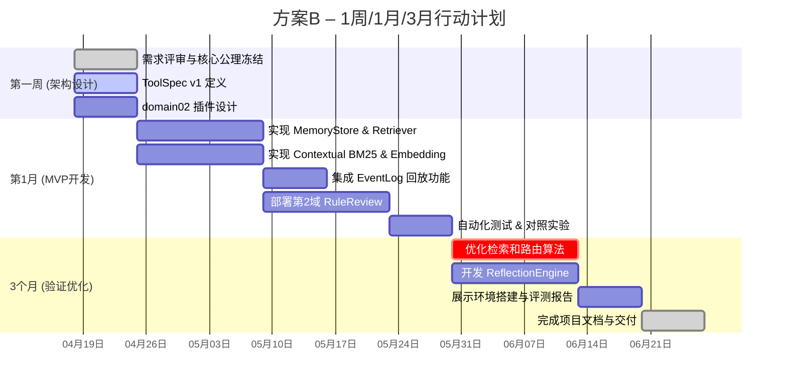

# 执行摘要

现有**认知执行引擎**项目已建立了显式状态存储、事件日志、策略和审批等核心要素，但在“连贯性 vs 通用性”的平衡上仍有提升空间。结合业内经验，我们设计了三条发展路线：**保守型**（以强化运行时稳定性和可审计性为主）、**平衡型**（兼顾状态持久化与灵活记忆检索）、**激进型**（引入高级认知循环和风险驱动机制）。三者分别面向不同用户场景。借鉴Letta的持久记忆【12†L218-L227】【27†L432-L441】、LangGraph的检查点持久化【14†L111-L118】、Anthropic的上下文检索优化【18†L28-L37】、MCP的工具调用协议【16†L86-L94】、NIST的可溯源/审计原则等最佳实践，我们对每个方案规划了关键模块、接口扩展、新算法及MVP指标，并设计了可运行实验和度量（包括审计/回放/失败覆盖）。最终综合可行性、差异性和风险，推荐**平衡型方案**为首选，具体行动计划见文末甘特图。

## 三个方案对比表

| 方案         | 定位       | 目标用户            | 核心差异化                                | 关键模块                      | 新增文件/接口                           | 算法/机制                                | MVP指标                                | 主要风险及缓解                        | 估计开发 (人月) |
| ------------ | ---------- | ------------------- | ----------------------------------------- | ----------------------------- | --------------------------------------- | --------------------------------------- | -------------------------------------- | --------------------------------------- | ------------- |
| **A. 稳健内核** | 保守型     | 企业级合规自动化、监管场景 | 以显式状态与审计为核心 严控LLM输出          | State 核心、事件日志、策略引擎、工具网关、审批流程 | - 增加工具语义层（reversibility, risk） - “状态差异报告”接口 | 事件溯源状态机【14†L111-L118】； MCP 工具调用【16†L86-L94】 | 任务成功率、安全事件率、审计完整度、回放一致性 | 灵活性不足 (难适应新域) →设计插件层、更新流程模板 | ~3人×4月 |
| **B. 平衡升级** | 平衡型     | 中大型知识型应用       | 结合稳定内核与结构化记忆 增强检索/学习能力      | A方案全部模块 + 记忆管理模块、上下文检索、证据图   | - 记忆库模块（语义向量+元数据） - 上下文还原接口 - 证据图构建工具        | Letta式持久记忆块【12†L218-L227】【27†L438-L447】； Contextual RAG【18†L28-L37】； 候选计划生成 + 策略筛选 | 文档问答准确率↑、迁移任务成功率、记忆命中率、审批次数降低 | 平衡性调参复杂 →逐步迭代，每次小范围上线测试 | ~4人×5月 |
| **C. 认知飞跃** | 激进型     | AI创新实验室、研究项目   | 引入多步推理循环 丰富风险模型与反思能力        | B方案模块 + 自我模型、分支执行、深度风险评估     | - 自我模型模块 - 分支决策管理器 - 高斯过程风险评估 - 多智能体协同接口 | 多步推理链/假设验证【29†L88-L91】【18†L28-L37】； 不确定性路由(贝叶斯/GP)； 信念+信息论 驱动机制 | 复杂任务成功率、策略探索度、回放覆盖度、异常降低 | 系统复杂度高、可解释性下降 →增加监控、逐步验证 | ~5人×6月 |

*备注：以上人月为粗略估计（3–6人规模）。“关键模块”与“新增文件”列列举主要组件。MVP指标视业务而定，如**任务完成率**、**检索准确率**、**审批率**、**错误/异常率**等。风险缓解方案要在开发中落地。 

## 方案 A（稳健内核）详细设计与实验

**定位：** 追求可控与安全的认知执行内核。重点强化**状态持久化**与**审计追溯**，将LLM生成能力降级为受限提议器。适合合规要求高的企业或政府场景。

- **目标用户：** 监管审计严格的自动化系统，如金融/医疗审批、合规审查等。
- **核心模块：** 
  - `State` (显式状态机，已实现)【14†L111-L118】  
  - `EventLog` (执行日志)  
  - `PolicyEngine` (权限、约束检查)  
  - `ApprovalGate` (人工审批接口)  
  - **工具调用协议**：基于MCP规范实现工具调用（工具名、输入/输出Schema）【16†L86-L94】  
  - 状态/审计支持模块：状态差分报告、ChangeTest机制
- **新增文件/接口：** 
  - `toolspec.py`：工具描述，增加`risk_level`、`reversible`等字段  
  - `state_diff.py`：状态差分计算接口  
  - `audit_ui.py`：审批包可视化报表接口  
  - MCP 客户端适配器（`mcp_client.py`）  
- **算法/机制：** 
  - **事件溯源**：每个操作通过 Reducer 更新状态，均记录在 EventLog 中，可回放【14†L111-L118】。  
  - **MCP工具调用**：LLM通过结构化输出触发 `tools/call`，系统校验权限后执行。【16†L86-L94】  
  - **审批策略**：根据工具风险级别和政策，由`PolicyEngine`决定是否需要人工审批（符合“Human-in-loop”最佳实践）【16†L102-L110】。  
- **MVP验收指标：** 
  - 任务完成率（对预定任务能否正确执行）  
  - 审计覆盖度（状态变化日志完整记录率≥99%）  
  - 审批精确度（阻断错误率、通过率）  
  - 回放一致性（同一事件序列重放结果一致）  
- **实验设计：**  
  1. **序列执行回放测试：** 输入一系列工具调用任务，记录EventLog。预期：通过回放机制，状态最终结果与原始执行一致；回放出错率接近0。*对照组：无持久化运行，直接LLM提示执行*；指标：回放一致性。  
  2. **策略拒绝测试：** 设计一个违反域约束的变更（如未授权写入），触发`PolicyEngine`拒绝。预期：系统识别并阻止写入，返回FailureMode=POLICY_DENIED；日志记录完整错误原因。*对照组：关闭策略检查*；指标：错误捕获率和正确拒绝率。  
  3. **安全工具调用测试：** 对高风险工具调用设定（如删除操作），验证是否进入人工审批流程。预期：自动路由至审批，人类同意后方可执行；若拒绝，则工具不被调用。指标：审批命中率和工具执行正确率。  
- **自动化测试与度量：**  
  - 编写pytest用例模拟任务流，检验`State`和`EventLog`输出  
  - 覆盖率工具统计事件日志记录和策略分支覆盖率  
  - FailureMode测试套件验证所有已知错误分类的触发情况  

- **五角度评估：**  
  - *状态化Agent：* 强调持久状态管理，使用Reducer对每步授权【14†L111-L118】；  
  - *工具协议：* 完整实现MCP规范，所有工具调用均通过接口校验【16†L86-L94】；  
  - *检索记忆：* 基本采用外部RAG拼接，无专门记忆结构；  
  - *不确定性决策：* 决策逻辑主要基于硬规则阈值、审批判据，缺少概率性风险评估；  
  - *治理审计：* 非常强：全步骤可追溯、审批可视化、符合NIST可审计要求（“追踪数据来源和修改”【23†L7-L13】）。  

## 方案 B（平衡升级）详细设计与实验

**定位：** 在方案A的基础上，**增加智能记忆和检索能力**，兼顾稳定内核与灵活应变。引入Letta式持久化记忆和Anthropic式**上下文检索**，提升对复杂任务的适应性和准确性。

- **目标用户：** 知识密集型应用场景，如跨文档问答、多步推理、协同办公等（比如持续的文档分析、客户支持自动化）。
- **核心模块（新增/升级）：**  
  - A方案所有模块  
  - **MemoryStore**：综合持久记忆模块，维护“核心记忆”与“外部记忆”【12†L218-L227】【27†L438-L447】  
  - **Context Retrieval**：支持上下文化检索（结合语义检索和BM25）【18†L28-L37】  
  - **EvidenceGraph**：构建推理过程的证据图，节点包括原始数据、推断、结论  
  - **ReflectionEngine**：运行时分析失败与反馈，向Memory生成新增知识  
- **新增文件/接口：**  
  - `memory_store.py`：记忆对象定义，接口`add_memory()`, `query_memory()`等  
  - `retriever.py`：上下文检索实现，支持“前缀+chunk”策略【18†L28-L37】  
  - `evidence_graph.py`：证据图数据结构与工具，接口如`add_node()`, `add_edge()`  
  - `self_reflection.py`：反思/反例学习接口（生成rule_candidate等）  
  - `planner.py`更新：支持生成候选计划图和策略筛选  
- **算法/机制：**  
  - **结构化记忆**：记忆条目结构化储存（如Letta Memory Block【27†L438-L447】），不只是文本，包含标签、向量、证据链接、失败率等；  
  - **上下文检索**：先对知识库chunk加前置上下文再索引（“contextual BM25/embeddings”【18†L28-L37】），显著降低检索失误；  
  - **证据图构造**：将模型生成的推理链映射为有向图，便于验证和合成结果；  
  - **候选计划 + 策略裁剪**：LLM输出多条可能的行动序列，`PolicyEngine`再过滤并选择；  
- **MVP验收指标：**  
  - 检索精度（如Top-K命中率）；  
  - 回答或任务正确率提升（相对Baseline↑）；  
  - 记忆使用率（查询次数/命中数）；  
  - 审批总数减少（自动通过率↑）；  
- **实验设计：**  
  1. **检索准确性对比：** 用一组文档检索任务测试Contextual RAG vs 标准RAG。输入：查询+知识库；输出：检索段落列表；指标：相关性评分↑（如Top3包含正确片段的比例）。对照组：不加前缀上下文的普通RAG。  
  2. **多步任务迁移测试：** 选两个领域（如文档分析 vs 规则审查），在第一个域训练/运行后，将内核不变切换到第二域，仅替换域插件，测迁移任务成功率。指标：迁移成功率差距（低于X%即失败）；对照：常规Agent需重写策略。  
  3. **记忆有效性测试：** 在连续对话或多轮任务中，测试系统能否“记得”前次关键信息。输入：含前后相关对话；输出：系统使用前文信息的正确回答；指标：利用记忆解决问题的正确率。对照：禁用MemoryStore，只用即时上下文。  
- **自动化测试与度量：**  
  - 使用**A/B测试**脚本对比带/不带新模块的版本；  
  - 测试覆盖率工具评估MemoryStore及Retriever代码分支；  
  - 失败模式覆盖率：记录系统未命中记忆或检索失败的案例，并统计比例；  
- **五角度评估：**  
  - *状态化Agent：* 保留显式状态管理；引入常驻Memory（让更多上下文保持可见）【27†L438-L447】；  
  - *工具协议：* 与方案A同样遵循MCP，用结构化工具输出；可增加工具元标注利用；  
  - *检索记忆：* 强化：采用Contextual Retrieval【18†L28-L37】；让MemoryStore承担高阶记忆；  
  - *不确定性决策：* 在候选计划阶段引入概率模型（如多样性生成）；但审批仍主要靠策略；  
  - *治理审计：* 保留A方案审计流程；额外记录记忆更新操作；  

## 方案 C（认知飞跃）详细设计与实验

**定位：** 实现**高度自治**的认知框架。强调**多步思维循环**与**风险自测**，打造类人“认知架构”原型。适用于前沿研究或高级自动化场景。

- **目标用户：** AI研发团队、创新实验室、中小企业可在沙盒环境尝试颠覆性功能的项目。
- **核心模块（新增/升级）：**  
  - B方案所有模块  
  - **MultiAgentController**：多智能体协同框架，允许分支并行推理  
  - **SelfModel**：代理自身能力/偏好模型，用于监控决策偏差  
  - **GP Risk Head**：不确定性估计算法，基于高斯过程等估计置信度  
  - **ReflectionEngine**：升级，支持从失败轨迹自动提炼规则、模型微调建议  
- **新增文件/接口：**  
  - `multi_agent.py`：定义Agent实体、协作协议  
  - `self_model.py`：内部配置与性能追踪接口  
  - `gp_risk.py`：高斯过程风险评估模块接口：`estimate_uncertainty()`  
  - `planner_ext.py`：支持分支计划和回退逻辑  
- **算法/机制：**  
  - **多步推理循环**：结合上述`ReasoningChain`、`HypothesisCycle`，让系统自动迭代：观察→假设→验证→反思【29†L88-L91】；  
  - **分支执行（Fork-Join）**：如OrKa所示，允许并行思考多个方案【7†L176-L183】；  
  - **不确定性路由**：使用GP或贝叶斯优化，在决策时将低置信度结果升级或委派人审；  
  - **自我监督反思**：定期审查自身决策与结果，自动产生“改进候选”（如Reflexion方法）  
- **MVP验收指标：**  
  - 复杂任务成功率提升（如需要多步推理的问题解答率）  
  - 决策多样性度（系统能探索多个解决方案）  
  - 失败/异常检测率（自动捕获并处理失败的能力）  
- **实验设计：**  
  1. **多分支规划测试：** 输入一个模棱两可的指令，系统生成多个执行分支（plans），分别执行并选择最佳。预期：至少生成2条合理方案，并根据结果或风险偏好选择最优。指标：分支覆盖度、最终方案正确率。对照：单一plan系统。  
  2. **风险-报酬平衡测试：** 提供带高风险的任务，如删除/操作关键数据。观察系统是否因风险自动请求审批或放弃。指标：在不同风险设置下，人审触发率与任务成功率曲线。对照：无风险评估的系统。  
  3. **自我修正测试：** 故意引入逻辑错误或不完整输入，让系统在后续交互中识别并纠正。指标：系统识别并修正错误的次数及最终完成任务率。对照：无反思机制的版本。  
- **自动化测试与度量：**  
  - 引入**混淆测试**（adversarial input）评估系统稳定性  
  - 统计多步推理输出的有效率和失败模式  
  - 使用自然语言解释 (解释性AI) 模块检验系统自我报告的可信度  
- **五角度评估：**  
  - *状态化Agent：* 同样保留核心状态；但在分支时可能产生多个并行状态，需要管理冲突回滚；  
  - *工具协议：* 延续MCP规范；可探索动态发现新工具（agent内部生成工具调用脚本）【10†L121-L130】；  
  - *检索记忆：* 和方案B一样，但更依赖于先例学习（Failure exemplar）与动态知识图谱；  
  - *不确定性决策：* 强化：内建置信度估计（GP/贝叶斯）驱动流程选择；  
  - *治理审计：* 较弱：高度自主意味着更多内部决策，需加强日志（如多线程的trace）和可解释性措施。  

## 风险矩阵与缓解措施

| 风险类型             | 影响面                                 | 严重度 | 可能性 | 缓解措施                                         |
| -------------------- | -------------------------------------- | ------ | ------ | ------------------------------------------------ |
| 核心功能复杂度过高   | 系统实现周期拉长；难以稳定运行           | 高     | 高     | 采用渐进迭代：先实现核心P0，再分步扩展；严格PR评审 |
| 功能可用性不足       | 系统僵化为高级工作流，失去灵活性         | 高     | 中     | 插件化设计，抽象**认知原语**，允许运行时扩展      |
| 记忆检索失效         | 检索结果缺失上下文，导致推理错误【18†L28-L37】 | 中     | 高     | 使用上下文检索+重排序【18†L28-L37】；增强证据图    |
| 审计与审批过度       | 严格合规导致交互卡顿或体验差             | 中     | 中     | 设置风险分级和阈值，仅对高风险操作启用审批；优化UI |
| 工具协议兼容性       | MCP版本升级或标准变更导致接口失效        | 中     | 中     | 遵循MCP稳定版；设计抽象接口便于快速升级           |
| 学习曲线与改错       | 团队上手难度大，误用模块造成错误         | 中     | 高     | 提供充分文档/示例；各阶段增加集成测试与变更测试    |
| 安全/隐私合规         | 生成式AI未经许可访问敏感数据风险         | 高     | 低     | 功能设计时遵守最小权限原则；日志可追溯；隔离测试环境 |
| 多线程/多Agent冲突   | 分支执行引起数据竞争或死锁             | 高     | 低     | 使用版本控制或事务机制管理State；充分测试并发场景 |

## 推荐方案与行动计划

**首选方案：方案B（平衡升级）**。理由：相比A方案，B在可控内核上引入记忆检索，有较强的差异化护城河和更高价值；相比C方案，B保持了合理的复杂度与可解释性，风险可控。我们采用3–4人团队，分阶段迭代实施：

以上甘特图展示了**方案B**在未来1周（架构冻结）、1月（MVP实现）、3月（功能验证）的关键任务。**首要实验**是“对照实验：带/不带记忆模块”的性能对比，使用自动化测试脚本模拟真实任务流，验证方案B在检索准确率、任务成功率、审批需求等指标上的提升。成功的话，说明内存检索策略有效；失败则需要调整检索逻辑或记忆结构。通过不断迭代和测量，我们能逐步验证并完善认知执行引擎的可靠性和灵活性。

**参考文献：** Letta记忆块【12†L218-L227】【27†L438-L447】；LangGraph持久化【14†L111-L118】；MCP工具协议【16†L86-L94】；Anthropic检索【18†L28-L37】；NIST AI治理【23†L7-L13】。